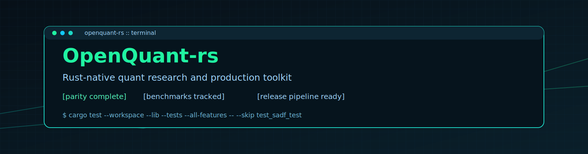

<p align="center">
  
</p>

<h1 align="center">OpenQuant-rs</h1>

<p align="center">
  <strong>Rust-native quantitative finance toolkit, migrated from mlfinlab with test parity.</strong>
</p>

<p align="center">
  <a href="https://github.com/Open-Quant/openquant/actions/workflows/ci.yml">CI</a>
  ·
  <a href="https://github.com/Open-Quant/openquant/actions/workflows/benchmark-regression.yml">Benchmark Regression</a>
  ·
  <a href="https://github.com/Open-Quant/openquant/actions/workflows/release.yml">Release Readiness</a>
</p>

## Status
- Python-to-Rust migration parity for tracked mlfinlab modules: complete.
- Source of truth: `openquant-rs/tests/crosswalk.md`
- Roadmap parity sync: `ROADMAP.md` remaining list is empty.
- Production baseline package: benchmarks + regression checks + release workflow are in place.

Detailed status: `docs/project_status.md`

## Quick Start
```bash
# Fast validation (default CI path)
cargo test --workspace --lib --tests --all-features -- --skip test_sadf_test

# Long-running SADF hotspot (explicit)
cargo test -p openquant --test structural_breaks test_sadf_test -- --ignored

# Benchmarks
cargo bench -p openquant --bench perf_hotspots --bench synthetic_ticker_pipeline

# Collect + check benchmark thresholds
python3 scripts/collect_bench_results.py --criterion-dir target/criterion --out benchmarks/latest_benchmarks.json --allow-list benchmarks/benchmark_manifest.json
python3 scripts/check_bench_thresholds.py --baseline benchmarks/baseline_benchmarks.json --latest benchmarks/latest_benchmarks.json --max-regression-pct 25
```

## Crate Layout
- `crates/openquant/src/`: core library modules
- `crates/openquant/tests/`: Rust test suite
- `crates/openquant/benches/`: criterion benchmarks
- `tests/fixtures/`: shared fixtures
- `tests/crosswalk.md`: Python-to-Rust parity map
- `benchmarks/`: baseline + latest benchmark snapshots

## Publish Readiness
- Publishing checklist: `docs/publishing.md`
- Stabilization + productionization checklist: `docs/stabilization_productionization.md`
- Latest benchmark report: `docs/benchmark_snapshot.md`

## Do You Still Need mlfinlab Locally?
Short answer: for runtime use, no. For ongoing parity maintenance and fixture regeneration, yes.

See full guidance in `docs/project_status.md`.

## Astro Docs Site (GitHub Pages)
A modern docs site scaffold is included under `docs-site/`.

```bash
cd docs-site
npm install
npm run dev
```

Build output is published by GitHub Actions workflow: `.github/workflows/docs-pages.yml`.

## License
MIT (`LICENSE`)
