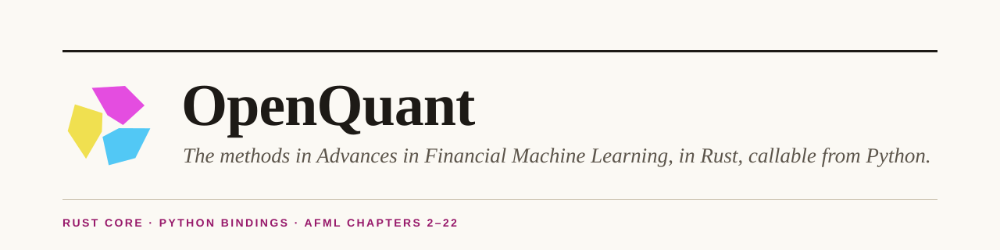

<p align="center">
  
</p>

<h1 align="center">OpenQuant</h1>

<p align="center">
  <strong>Rust implementations of the methods in <em>Advances in Financial Machine Learning</em>, with Python bindings.</strong>
</p>

<p align="center">
  <a href="https://github.com/Open-Quant/openquant/actions/workflows/ci.yml"></a>
  <a href="https://github.com/Open-Quant/openquant/actions/workflows/docs-pages.yml"></a>
  <a href="LICENSE"></a>
</p>

<p align="center">
  <a href="https://open-quant.github.io/openquant/"><strong>Documentation</strong></a>
  ·
  <a href="https://open-quant.github.io/openquant/quickstart/">Quickstart</a>
  ·
  <a href="https://github.com/Open-Quant/openquant/issues">Issues</a>
</p>

## Status
Pre-release (0.1.0, unpublished). The Rust core covers most AFML chapters and is
tested in CI; the Python bindings expose 27 submodules. Nothing is on crates.io or
PyPI yet, so installing means building from source. Open work is tracked in
[issues](https://github.com/Open-Quant/openquant/issues); the reasoning behind it is in
`docs/design/production-readiness-brief.md`.

## Install
Requires a Rust toolchain (pinned by `rust-toolchain.toml`), Python 3.11+ and
[`uv`](https://docs.astral.sh/uv/).

```bash
git clone https://github.com/Open-Quant/openquant.git && cd openquant
uv venv --python 3.13 .venv
uv sync --group dev
uv run --python .venv/bin/python maturin develop --manifest-path crates/pyopenquant/Cargo.toml
uv run --python .venv/bin/python python -c "import openquant; print('ok')"
```

The Python distribution will be published as **`pyopenquant`**; the import name is
`openquant`. Do not `pip install openquant` - that name on PyPI belongs to an
unrelated project.

## Quick Start
```bash
# Fast validation (what CI runs on every PR)
cargo test --workspace --lib --tests --all-features -- --skip test_sadf_test

# Long-running SADF hotspot (explicit; CI runs it nightly and on release tags)
cargo test -p openquant --test structural_breaks test_sadf_test -- --ignored

# Benchmarks
cargo bench -p openquant --bench perf_hotspots --bench synthetic_ticker_pipeline

# Collect + check benchmark thresholds against the committed baseline (machine-specific;
# CI instead compares a PR's head with its base on the same runner)
python3 scripts/collect_bench_results.py --criterion-dir target/criterion --out benchmarks/latest_benchmarks.json --allow-list benchmarks/benchmark_manifest.json
python3 scripts/check_bench_thresholds.py --baseline benchmarks/baseline_benchmarks.json --latest benchmarks/latest_benchmarks.json --max-regression-pct 35 --overrides benchmarks/threshold_overrides.json
```

## Research Flywheel (Python + Rust)
```bash
# Python env + bindings
uv venv --python 3.13 .venv
uv sync --group dev
uv run --python .venv/bin/python maturin develop --manifest-path crates/pyopenquant/Cargo.toml

# Notebook logic smoke + reproducible experiment run
uv run --python .venv/bin/python python notebooks/python/scripts/smoke_all.py
uv run --python .venv/bin/python python experiments/run_pipeline.py --config experiments/configs/futures_oil_baseline.toml --out experiments/artifacts

# Rust notebook-companion smoke
cargo run -p openquant --example research_notebook_smoke

# Python pipeline micro-benchmark (for speed demos)
uv run --python .venv/bin/python python python/benchmarks/benchmark_pipeline.py --iterations 30 --bars 2048

# Python data-processing benchmark (per-function throughput/latency + JSON output)
uv run --python .venv/bin/python python python/benchmarks/benchmark_data_processing.py --rows-per-symbol 200000 --symbols 4 --iterations 7 --out benchmarks/data_processing/latest.json
```

## Crate Layout
- `crates/openquant/src/`: core library modules
- `crates/openquant/tests/`: Rust test suite
- `crates/openquant/benches/`: criterion benchmarks
- `tests/fixtures/`: shared fixtures
- `benchmarks/`: baseline + latest benchmark snapshots
- `notebooks/`: Python notebooks + Rust Evcxr companions
- `experiments/`: config-driven experiment runner + artifacts

## Publish Readiness
- Publishing checklist: `docs/publishing.md`
- Stabilization + productionization checklist: `docs/stabilization_productionization.md`
- Latest benchmark report: `docs/benchmark_snapshot.md`
- Python bindings quickstart + API map: `docs/python_bindings.md`
- Notebook-first workflow + promotion checklist: `docs/research_workflow.md`

## Docs site
The documentation at https://open-quant.github.io/openquant/ is built from `docs-site/` (Astro + Starlight).

```bash
cd docs-site
bun install
bun run dev
```

Build output is published by GitHub Actions workflow: `.github/workflows/docs-pages.yml`.

## License
MIT (`LICENSE`)
