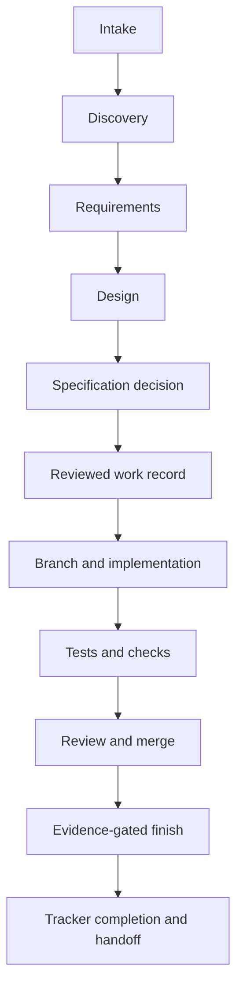

# AI-DLC development workflow

This is the project entry point for the AI-DLC lifecycle. It describes stable
stages; the [tool map](workflows/tool-map.md) shows which configured provider or
service currently performs each role. The CLI owns lifecycle mutation; MCP
exposes only its reviewed work, doctor, and knowledge services.

The selected harness can use installed tools directly. AI-DLC equips it with
environment setup, project structure, guidance, and integration; the services own
specific validation and completion boundaries. UI/UX is an optional workflow
within product development, alongside other design and verification methods.

Requirements explain outcomes; formal specifications define behavior; tickets
organize deliverable slices; tasks describe implementation steps. Keep references
between these artifacts instead of duplicating their contents.

- [Greenfield development](workflows/greenfield.md)
- [Brownfield development](workflows/brownfield.md)
- [Design to implementation](workflows/design-to-implementation.md)
- [Tools, skills, services, and artifact ownership](workflows/tool-map.md)



## Stage contract

| Stage | Durable output | Exit condition |
| --- | --- | --- |
| Intake and discovery | Bounded problem, evidence, assumptions, and next investigation | The problem is clear enough to define or stop |
| Requirements | Reviewed outcomes, scope, constraints, risks, and acceptance | Material product questions are resolved or named |
| Design | Journey, states, system boundaries, decisions, and verification strategy | Implementation does not need to invent product behavior |
| Specification decision | Recorded decision and provider-owned specification when required | Required scenarios are current |
| Publish and start | `.ai-dlc/work/<id>.toml`, tracker item, and bound branch | Reviewed scope is linked before implementation |
| Implement and verify | Code, tests, migrations, and current durable docs | Required local checks pass |
| Review, merge, and finish | Reviewed PR, merged SHA, CI receipts, and deployment evidence when configured | `ai-dlc work finish <work-id>` accepts every finish gate |
| Continuity | Handoff, runbook updates, and linked personal notes | Remote state and next action are unambiguous |

Evidence such as documentation-impact dispositions names the exact target-branch
commit it reviewed, and pull request checks do not rerun when that branch moves.
Immediately before merge, update the branch from the target branch, refresh that
evidence and wait for fresh required checks. Where the SCM supports it, require
branches to be up to date before merging.

Finish reads the archived specification from the working checkout, which must be
exactly the pull request's merge commit with a clean specification tree. Finishing
right after merge satisfies this from the updated main checkout. When the target
branch has already moved, add a temporary detached worktree at that merge commit,
run finish there and remove the worktree afterwards. The blocked reason names the
expected merge commit and the revision the checkout holds.

## Sources of truth

- This repository owns architecture, rationale, design, decisions, runbooks,
  code, and tests.
- The specification provider owns formal behavior and scenarios.
- The tracker owns priority and lifecycle status.
- SCM and CI own review, merge identity, and merged-revision evidence.
- Personal knowledge owns private continuity and links; it is not a repository
  mirror.
- Portable configuration may name required environment variables but never
  contains their secret values. Machine configuration owns account choices and
  local paths. `.ai-dlc/local/` may hold ignored non-secret control-plane IDs
  and local metadata. Actual credential values stay in an OS keychain, password
  manager, or secret injector and enter only the process environment.

## Design to implementation ownership

For both greenfield and brownfield work, skills own discovery, requirements,
design judgment, and the specification decision. The CLI owns reviewed work
records, local checks, machine lifecycle commands, and completion gates. Local
MCP exposes reviewed work operations, read-only doctor inspection, and selected
knowledge operations; machine enrollment mutations are CLI-only in this cycle.
It does not create a second workflow. The design-to-implementation handoff is complete only when the
approved design, any required specification, and the reviewed work record let
implementation proceed without inventing behavior.

## Portable profile and machine enrollment

Keep a personal `ai-dlc-profile.toml` in a separate private Git repository and
pin the revision enrolled on each machine. The profile owns portable modules,
logical credential requirements, and agent preferences; the project repository
owns shared policy and durable docs. Each machine independently owns its
binding, including paths, account selection, and environment-variable names.
Credential values belong only to a password manager, keychain, or process
environment. Generated Codex and Claude client files remain owned by their
client configuration, which AI-DLC updates through its ownership rules.

Use `ai-dlc machine status`, `plan`, `apply`, `sync`, and `doctor` to inspect,
preview, reconcile, update, and diagnose local enrollment. Local CLI and MCP
execution are the current control plane; hosted or cloud execution is a later
qualification target. Obsidian create/attach and provider discovery are
next-cycle gaps, so knowledge remains provider-neutral and is attached only to
an explicitly selected existing store.

Preview a private profile enrollment can materialize an inactive cache, but it
does not change active enrollment, client configuration, or package state.
Repeat the same command with `--apply` to activate it:

```sh
ai-dlc machine enroll SOURCE --profile-id example-development --machine-id MACHINE_A --ref IMMUTABLE_REF_OR_TAG
ai-dlc machine enroll SOURCE --profile-id example-development --machine-id MACHINE_A --ref IMMUTABLE_REF_OR_TAG --apply
```

The lock always records the exact resolved commit. An immutable advertised tag
or ref gives cross-machine reproducibility, and `ai-dlc machine sync` is
idempotent for it. An intentionally movable advertised branch instead enables
`ai-dlc machine sync` to preview a candidate and `ai-dlc machine sync --apply`
to activate it after validation and reconciliation. To move from one immutable
tag to another, reenroll with the new ref. Enroll a second machine with the
same advertised ref under the selected policy and a different machine ID; its
local binding remains independent.

## Capability boundaries

This handbook ships for every capability selection. This project was generated
with:

- `specs`: configured
- `tracker`: configured
- `knowledge`: configured
- `scm`: configured
- `deploy`: configured
- `agent-client`: configured

Capability selection controls declared roles and generated provider assets. The
runtime retains compatibility fallbacks for local OpenSpec and GitHub, but a
fallback does not choose an account, repository, or authorization and must not
be mistaken for a configured role. GitHub uses conventional `verify.yml` and
`main` defaults unless overridden. The tracker has no fallback.

Apply these boundaries:

- Project setup, checks, architecture, design, decisions, and runbooks work
  without external providers.
- `work status` inspects the local record and specification archive state without
  querying the tracker. Read the configured tracker directly for current remote status.
- The complete publish/start/finish lifecycle requires configured
  tracker and SCM roles. Without both, use local checks and manual tracking, or
  configure the missing role before publishing work.
- Without a declared specification role, work may deliberately use the local
  OpenSpec compatibility fallback when its artifacts exist. Otherwise, work
  must record `requires_spec = false` with a reviewed reason or configure the
  role.
- Knowledge, deployment evidence, and agent clients are optional; omit their
  stages when the corresponding role is not selected.
- Omitting SCM also omits the generated GitHub workflow and makes
  merged-revision CI completion unavailable.

Keep stages provider-neutral. When a tool changes, update `ai-dlc.toml` and the
tool map rather than redefining the lifecycle. Keep Mermaid beside the text it
explains so diagrams and decisions evolve in the same pull request.
