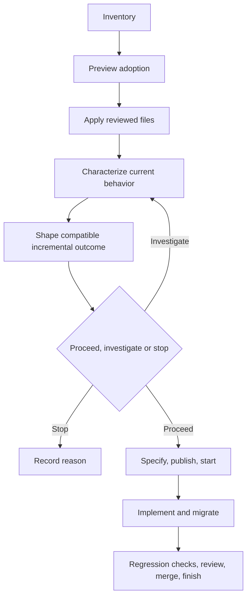

# Brownfield workflow

Use this path when adopting AI-DLC into an existing repository or changing an
existing product. Preserve application files and observed behavior while
introducing workflow controls deliberately.

[Back to the workflow map](../development-workflow.md)

1. Inventory manifests, lockfiles, boundaries, interfaces, CI, runbooks,
   existing documentation, and owner-written files on managed paths.
2. Establish a clean baseline and add characterization tests for important
   behavior that is not already protected.
3. Preview with `ai-dlc project adopt --root /path/to/project --preset generic`.
   Apply only after reviewing every proposed file and conflict. Adoption never
   creates application source for an existing project.
4. Separate application-owned, template-managed, provider-owned, and
   machine-local state. Keep credentials and caches out of portable files.
5. Use discovery and the [product brief](../templates/product-brief.md) to inspect
   behavior, tests and consumers. Separate evidence, actual decisions and hypotheses.
   Follow the [brownfield example](../examples/product-shaping/brownfield.md).
   Compare options, including keeping current behavior, by impact, confidence,
   effort and dependencies. State compatibility, migration, rollout and recovery.
   Keep stable OUT-001/RQ-001 IDs in one canonical brief and end with proceed,
   investigate or stop plus reasons. Resolve contradictions with their owner;
   an additive alternative is a proposal until decided. Preserve default contracts.
   Proceed within existing authorization when material constraints are resolved;
   otherwise bound the investigation. UI and a larger PRD are optional. Fixture
   success is not live qualification. Discovery does not authorize publication.
6. Record the specification decision. Use the configured provider or local
   OpenSpec compatibility fallback when formal behavior is required; otherwise
   record `requires_spec = false` and its reviewed reason.
7. With tracker and SCM configured, publish and start reviewed work, merge
   through SCM, and use `ai-dlc work finish <work-id>` after review. Otherwise,
   use local checks and manual tracking without claiming AI-DLC remote
   completion. In either path, protect the change with regression and
   acceptance tests.

Copier updates use a staged three-way merge. Conflicts or a concurrently changed
checkout leave the destination untouched and require a fresh preview. Runtime,
Git, dependency, ignored, and `.ai-dlc/local/` files are not copied through the
staging area.

Local work is done when required old and new behavior is verified and
migrations and runbooks are current. With tracker and SCM configured, done
additionally means the reviewed PR is merged and AI-DLC accepts every finish
gate.
