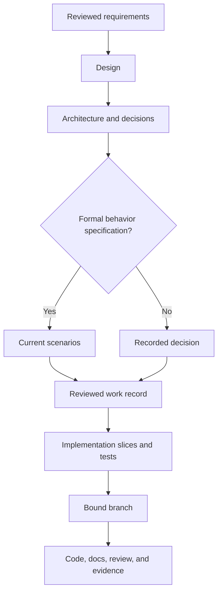

# Design to implementation

A design explains intent, journeys, constraints, system boundaries, and
decisions. It links to requirements and formal specifications without copying
them. Implementation is ready when the following evidence is present or
explicitly judged unnecessary.

Begin with evidence, assumptions, alternatives, and a shaped product outcome.
New products need a smallest useful slice; existing products need observed behavior
and compatibility boundaries. Apply UI/UX exploration only where relevant and
scale documentation and evaluation to the change's scope and risk.

[Back to the workflow map](../development-workflow.md)

| Area | Evidence |
| --- | --- |
| Identity | Work ID, title, owner, status, tracker, and requirements links |
| Outcome | Audience, problem, measurable outcome, scope, and non-goals |
| Journey | Entry point, main path, states, permissions, errors, empty/loading states, and accessibility |
| System | Deployment and module boundaries, interfaces, data ownership, dependencies, and failure behavior |
| Decisions | Alternatives, selected approach, consequences, and linked ADRs |
| Behavior | Acceptance criteria and current formal specification when required |
| Verification | Acceptance, regression, integration, migration, security, and operational tests as applicable |
| Delivery | Incremental slices, compatibility, rollout, observability, recovery, and rollback |
| Traceability | Work record, decisions, specification, branch, PR, and runbooks |

For greenfield work, center the handoff on one deployable boundary and vertical
slice. For brownfield work, begin with current behavior, callers, data,
compatibility promises, characterization tests, and an incremental transition.

If implementation uncovers a material product, interface, security, migration,
or operational choice that the design does not answer, pause and update the
reviewed artifact. Small implementation details may remain in code and tests;
decisions future maintainers need belong in repository documentation.

For projects with tracker and SCM roles, link the reviewed design to the work
record before publication and use `ai-dlc work finish <work-id>` after merge.
Without those roles, keep the same design evidence and test discipline but use
the project's manual lifecycle until the roles are configured.

## From requirements to finishable work

Use spec-from-prd with a reviewed canonical brief or PRD. Keep OUT/RQ IDs owned
by that source; link requirement → formal scenario (when required) → deliverable
work ID → implementation step → observed verification. Product rationale belongs
in the brief/design, behavior with the selected specification provider, delivery
status in work/tracker, and implementation steps inside the work item.

One behavior ticket owns one independently finishable OpenSpec change. A parent
epic coordinates children without one shared specification gate. Tests, parser,
docs and refactoring checkboxes are steps, not automatic extra tickets. A
verification-only item records `requires_spec=false` and its reviewed reason,
references existing behavior and retains all applicable completion gates.

See [localized export](../examples/delivery-slices/localized-export.md)
and [compatibility rehearsal](../examples/delivery-slices/compatibility-rehearsal.md).
These synthetic examples propose local IDs and document destinations; they do
not install records, create remote work or establish actual approval/live results.

Create a draft with `ai-dlc work new WORK_ID --from-issue REF`, or use explicit
`--title`, `--scope` and repeated `--acceptance` values for offline work. The command
copies the configured binding roles and issue acceptance bullets when present;
missing source content and the default specification decision remain explicit
TODOs. Explicit flags override derived fields. New records are always unreviewed:
replace TODOs, link the formal artifacts and review the scope before setting
`reviewed = true` and publishing or starting. Existing records and unsafe IDs
are refused without being overwritten; offline drafting creates no mutation state.

Work records accept optional `requirements` and `depends_on` lists, defaulting to
empty for older work. Requirements are nonblank single-token IDs, not copied spec
prose or paths automatically interpreted as source documents. Put canonical source,
plan, specification and evidence references in `artifacts`. Dependencies name local
work IDs in `.ai-dlc/work/`; preserve their pinned providers and binding identity.

Run `ai-dlc work validate WORK_ID --root .` before publication. It returns valid
(exit 0) or invalid (exit 1), reads only the selected dependency closure, and
initializes no mutation journal. Missing/unsafe IDs, self/cycles, invalid records,
binding drift and missing local artifact files/directories fail before publish
or start effects. Unrelated drafts do not block the selected work. Local artifact
paths must remain in the repository without symlinks. Fragments are retained as
references without interpreting specification text. HTTP(S) references are not
probed, and tracker/PR/branch/deployment/knowledge references remain provider-owned.

A suffix-less specification path whose first segment is a repository directory,
such as an OpenSpec change directory, stays a local artifact after the directory
is moved and is reported as absent; an opaque slash ID or provider URI that is
not anchored in the repository stays provider-owned. `ai-dlc work validate --all
--root .` validates every record's shape, local artifacts and dependency graph
together, offline and without resolving provider bindings, so finished records
with historical fingerprints do not fail it. Run it as a required project check
so archiving cannot leave a dangling reference undetected.

Binding drift is a mutation-time refusal, also surfaced by single-record validation.
For active work, review the record against current provider configuration, remove
only the drifted binding under `[bindings]`, and run `ai-dlc work validate WORK_ID`;
the next normal work mutation persists the reviewed binding. Preserve finished
records' historical bindings and check them with `ai-dlc work validate --all`.
`project rebind` migrates a provider role and is not a binding-drift repair command.

Validation does not approve scope or prove completion. `work start` freshly reads
every reachable dependency through its pinned tracker and requires canonical
`closed`. Cancelled, duplicate, incomplete, unpublished or unavailable statuses
block before branch creation, work saves or tracker changes. Resolve missing
interfaces/status with their owners; prepare independent local drafts meanwhile.

First issue creation includes scope, requirement/dependency references, artifacts,
specification decision and acceptance. Re-publication reconciles the existing
mapping/correlation without overwriting authored descriptions or changing prior
journal identities. It does not publish updated scope into an existing issue.
Keep unresolved product semantics and unperformed live checks visible. Review,
merge, exact-revision evidence and `ai-dlc work finish` remain the completion path.

Specification references may be provider-native IDs or explicit local documents.
Native IDs (including slash IDs and provider URIs) are not interpreted as missing
repository files. Use `./name` for an ambiguous local directory; filesystem
notation, document suffixes such as `.md`, and existing repository paths receive
local containment/existence checks. This does not replace the specification
provider's archive or finish validation.

Archive the required OpenSpec change on its delivery branch before merge with
`ai-dlc work archive <work-id>`. It promotes the specifications, repoints the
record and any plan inside that change, and commits only affected specification
files and the record. Commit or preserve any dirty shared canonical specification
before archiving. `work status` reports local specification state without a network
call; an active change is also warned about by `work pr`. If the archive command
fails, inspect its local changes before retrying.

## Optional interface evaluation

When a shaped increment needs visual or interaction judgment, use design-brief
with the canonical product brief and delivery slice/RQ IDs. Create a brief and
versioned rubric before generation; keep proposed defaults and task-specific
budget approval distinct. Small brand-constrained fixes may use one concise
combined record and the existing component system.

Use the [design brief](../templates/design-brief.md),
[rubric](../templates/design-rubric.md),
[evaluation](../templates/design-evaluation.md) and
[selection](../templates/design-selection.md). The
[original library-room examples](../examples/design-evaluation/library-rooms.md)
show failed journeys, brand fit, static limitations and earlier-candidate selection.
They contain synthetic observations, not executed UI or human preference evidence.

The chosen existing visual tool generates an identified candidate. Design-evaluate
receives its revision/digest, brief, rubric and access instructions; a separate
session or human is an available review route. Same-session generator review is
self-review. A required failure blocks design acceptance, and absent interaction
evidence stays unverified regardless of visual scores. Keep reports and findings
with their exact candidate and rubric; a new rubric requires reevaluation.

Retain `docs/design/<work-id>/brief.md`, `rubric.md`,
`iterations/<candidate-id>/evaluation.md` and `decision.md`, or equivalent stable
sections in a concise record. Stop on the declared budget/plateau/decision boundary
without inferring success or more authorized rounds. Select an earlier revision
when its matching evidence qualifies. Hand the selected design, remaining findings
and behavior requirements to needs-spec and the existing delivery workflow.

The [calibration protocol](../examples/design-evaluation/calibration.md)
requires a separately approved experiment and human participation. It remains
unrun; readable Markdown and packaging checks establish no client capability or
design-quality gain. This optional route adds no service, model, CLI or finish gate.

## Frontend smoke and capture evidence

Select `--preset node --capability frontend` when initializing or adopting a
frontend project; repeat the other desired role capabilities explicitly. New
projects pin `@playwright/test` to 1.58.2. Adoption preserves your package manifest;
add that exact development dependency and update its lockfile during setup.
Run dependency setup with `PLAYWRIGHT_SKIP_BROWSER_DOWNLOAD=1`, then explicitly
install the browser with `npx --no-install playwright install chromium`. Checks
never install packages or browsers. The required frontend-smoke check exits
successfully with a skip message until `BASE_URL` names your running app; with
that URL it visits the root, checks a nonempty title and records a screenshot
under `.ai-dlc/local/design/smoke/`. A skipped check does not verify the app.

Run `ai-dlc design capture --url http://localhost:3000 --viewport 1280x800
--viewport 390x844 --state ready=#ready` from the project after browser setup.
The default destination is a new timestamped `.ai-dlc/local/design/` directory;
`--out` selects another new or empty directory inside the repository. Output
paths must not escape or traverse symlinks. Capture records PNGs and a
`manifest.json` with URL, timestamp, dimensions, named states and file references.
A state selector waits for visible page content before taking a viewport
screenshot; it does not click controls or prove an interaction journey. Cite the
manifest and its images in the evaluation and keep uncaptured states or untested
interactions unverified. On failure, inspect the partial capture directory;
a complete manifest is written only after every screenshot succeeds.

Select both `--capability backend --capability frontend` for a node project that
needs API contract validation and browser smoke. Both required checks remain
active, setup prepares each pinned tool once, and frontend keeps Node 22.23.1.
Adoption preserves an authored package manifest; add the documented Playwright
dependency deliberately before running smoke.
