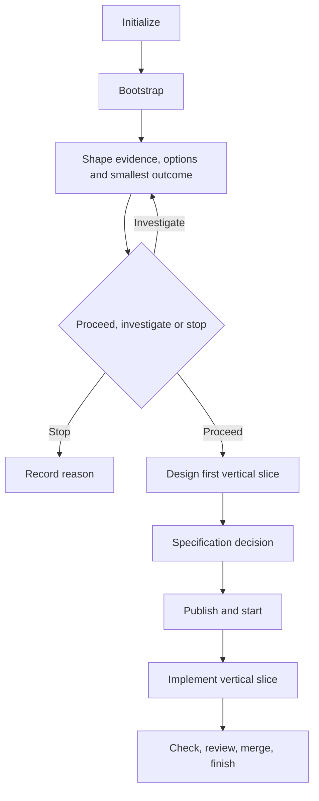

# Greenfield workflow

Use this path for a new deployable application. Start with one application and
one end-to-end user outcome; split deployment only when requirements justify
independent operational ownership.

[Back to the workflow map](../development-workflow.md)

For an HTTP backend, include `--capability backend` in the selected capability list.
It creates `docs/api/openapi.yaml` with a health endpoint, catalogs the contract,
and adds `api-contract`. Setup prepares exact pinned validators; subsequent checks
use offline execution. Python uses openapi-spec-validator 0.7.2 and Node uses
Redocly CLI 1.34.16; generic and Rust use the pinned Python validator through uvx.
Python also adds `api-contract-drift`, which skips absent/non-FastAPI apps and
compares one `src/<pkg>/app.py` FastAPI app against the committed contract with a
readable diff. It imports the supported application modules, including re-exports
and factory-created apps, using the project environment. Update the contract with HTTP behavior changes and record its path
as `artifacts.contract`; the check never rewrites it.

1. Select only the needed provider roles and initialize with the relevant
   preset, for example `ai-dlc project init my-project --preset python --apply`.
2. Run project setup and required checks. Initialized language presets create a
   minimal application and real syntax/compiler check; first setup creates the
   lockfile and later setup remains locked.
3. Use discovery and the [product brief](../templates/product-brief.md) to record
   audience, observed evidence, actual user decisions, hypotheses and exclusions.
   Compare feasible alternatives by impact, confidence, effort and dependencies.
   Select the smallest useful outcome or a bounded investigation; retain unknowns.
   Follow the [greenfield example](../examples/product-shaping/greenfield.md).
   Keep stable OUT-001/RQ-001 IDs in one canonical brief and end with proceed,
   investigate or stop plus reasons. A feature request is not validated value.
4. Proceed within existing authorization once material constraints are resolved.
   Small work can keep the brief alone; expand with prd-draft only when useful.
   Record deployment boundary, modules, interfaces and operational assumptions.
   Design methods fit the slice: UI states/accessibility when relevant, contracts
   or operational checks otherwise. Discovery does not authorize publication.
5. Record the formal specification decision. Make required scenarios current
   through the configured provider or a deliberately used local OpenSpec
   compatibility fallback; otherwise record `requires_spec = false` and its
   reviewed reason.
6. With tracker and SCM configured, review the work record, then publish and
   start it through AI-DLC. Otherwise use local checks and manual tracking until
   those roles are configured.
7. Implement the smallest coherent slice, add acceptance tests, and extend
   required checks as behavior grows.
8. Always run required local checks. With tracker and SCM configured, review
   and merge through SCM and use `ai-dlc work finish <work-id>` to validate the
   merged revision before tracker completion. Otherwise close the manual
   lifecycle without claiming AI-DLC remote completion.

The slice is ready when its user, outcome, design, specification decision, and
test strategy are explicit; configured remote work also requires a reviewed
work record. Local work is done when code and durable documents agree and
required checks pass. With tracker and SCM configured, done additionally means
the PR is merged and finish gates accept the remote evidence.
